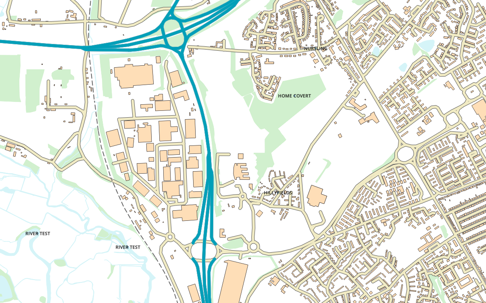
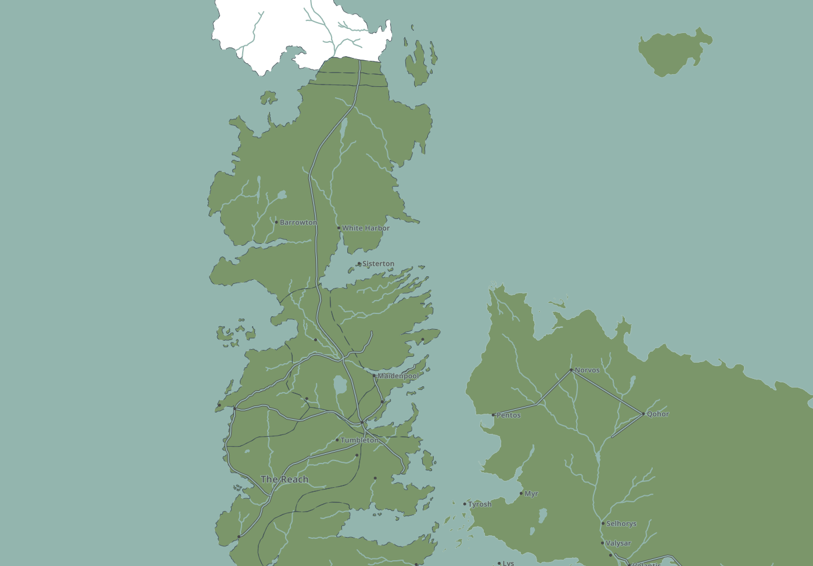

# gräva - prototype MVT server for PostGIS

This project is a `Go` server for generating mapbox vector tiles from Postgres/PostGIS database. It started as an experimentation to learn about
the mapbox vector tile format. 

The server is very alpha, but is usable - more work is needed (especially around testing which I have woefully neglected).

Sample screens below from:

+ [Open Map Local](docs/samples/os/opmplc/OPMPLC.md)
+ [Game of Throne]((docs/samples/got/)

|||
|--------------------------------------------------------------------------------------------|----------------------------------------------------------------------|
|||

## Building

The following are required for building:

| Tool      | Version       | Download                          |
|:----------|:--------------|:----------------------------------|
| Go        | `>= 1.8`      | [Download](https://golang.org/)   |
| Glide     | `>=0.12.3-2`  | [Download](https://glide.sh/)     |

In the following instructions, `GRAVA_ROOT` referes to the location the package is checked out

    git clone git@github.com:devork/grava.git
    cd grava

Dependencies are managed through Glide:

    glide install

And then the actual build:

    cd cmd/gravad
    make build

## Running

For running instructions, use:

    grava --help

Details of the configuration file can be found in [CONFIG.md](docs/CONFIG.md).